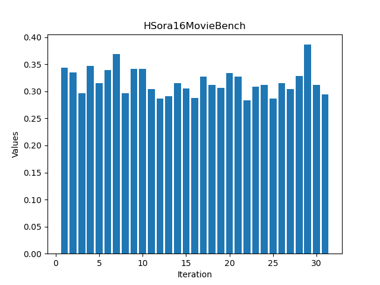
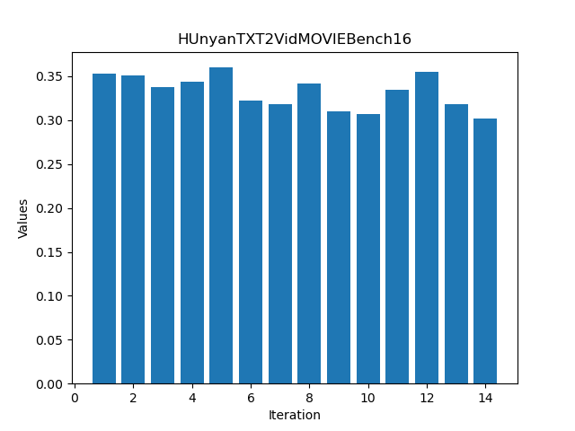
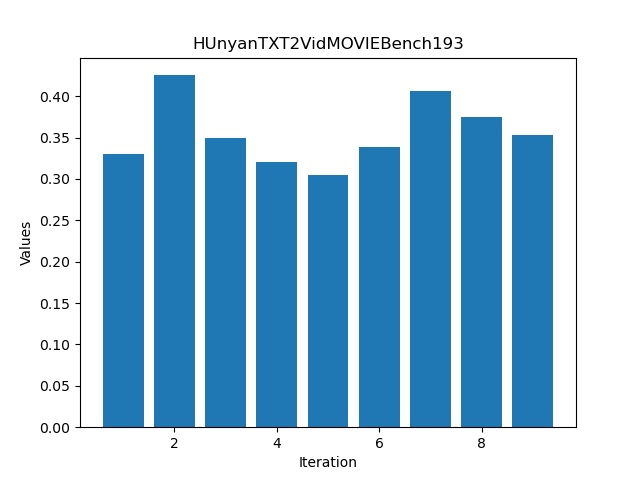
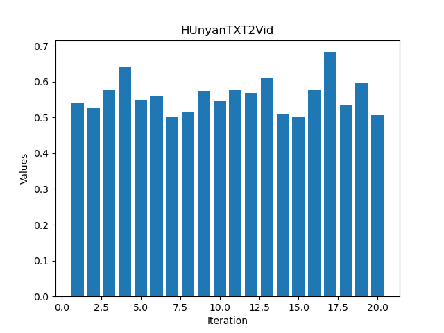
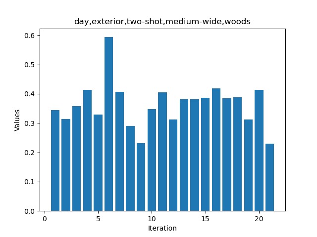
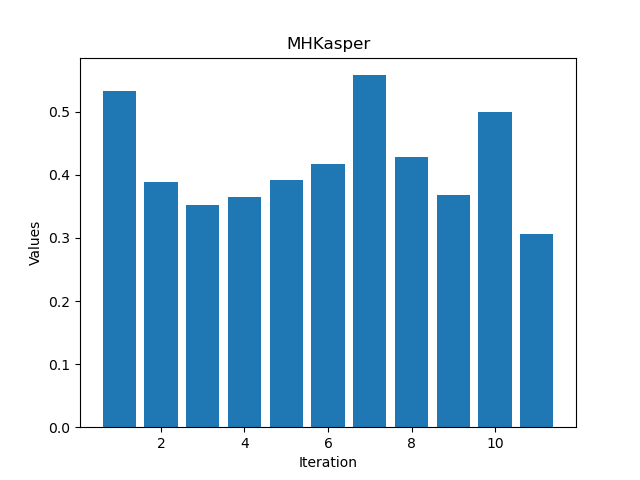
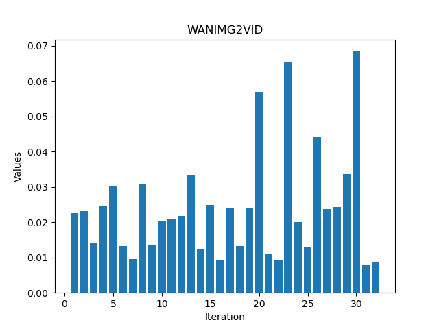

# Conclusion:
Finding the exact reason for the surprisingly high simmilarity of the movie benchmark prompts to model-outputs across architecturse is a little hard, data leakage seems likely. Comparing that to the somewhat low variance for LPIPS Scores to different categories it might be a hint towards a high reliance on training data distribution and natural occuring biases across online datasets, in addition to feature Entanglement of Diffusion Models: https://arxiv.org/pdf/2210.04885, the sole reliance on text-prompts for conditioning image generators is not only a relatively unusable tool for artists, it might also be reducing variance in output wich is the exact opposite of the "democratization" of art that gets claimed by model developers in anderesen vs. stabillity. The possibillity of multimodal conditioning in all sorts of forms might help to mitigate these promblems on the user-side. But it also reduces output dimensionality towards a lower entropy outcome, that when not used properly can make copyright infringement more likely.

# Data (WIP)
Running Meta-Movie Bench Prompts on different architectures shows a way too simmilar LPIPS simmilarity score across Models. That is likely due to data-leakage into the training data. 

or could be another indicator of too strong biases inside the training data

Adjusting for new visual Features outside the training set (comparison to new datapoints of my own prompts and self shot movie clips) reveals much lower LPIPS Values.

To compare that to another baseline. A site named https://shot.cafe/ lets users sort reference images by tags. Albeit this is not exactly like the relation from Prompt to text it serves a somewhat simmilar purpose, i.e. visual representations across textual descriptions. To get somewhat usable results there were always 4 Tags as visual feature descriptions chosen. Wich is is a somehwat deeper description than most prompts inside the moviebench score or the collection called "parti prompts". The evaulation revealed a much higher variance in visual represenations than any textprompt to image distribution.

Same goes for a mood board to final result relation by a artist friend:

While just text prompting alone isnt sufficient in reaching a good simmilarity score across shots. Img2Vid Condition reveal very effective results across models (WAN + Hunyuan)

# usefullworkflows
Comfyui Workflows are from:
https://www.reddit.com/r/StableDiffusion/comments/1j209oq/comfyui_wan21_14b_image_to_video_example_workflow/
https://www.reddit.com/r/StableDiffusion/comments/1hgtsmi/hunyuan_works_with_12gb_vram/

CSV is Metas Movie Benchmark but with added numbers, cause its easier to handle that way
